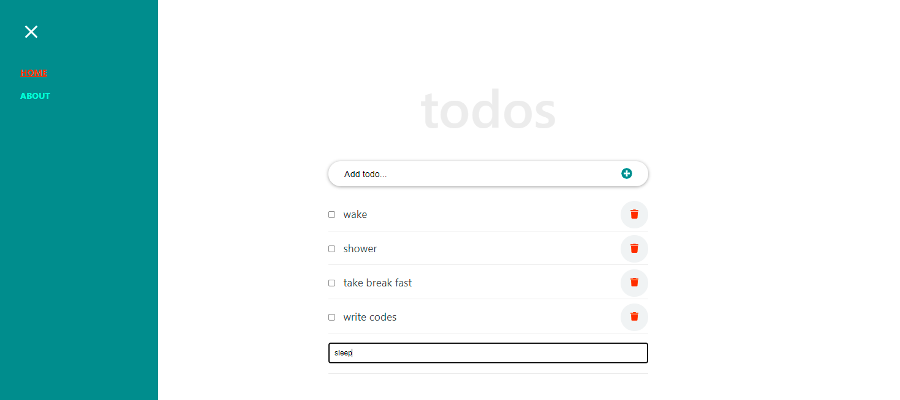

# Module 1: Capstone Project

> We made up Capstone Project with javascript 
> Our project get data from API and we can send data with another API

## Built With
- Reactjs

## Getting Started
To get a local copy, follow the bellow steps;
### Prerequisites

### Setup
To get this project in your local machine, follow these steps:
- Open terminal 
- clone the repository :https://github.com/ishimwezachee/TodoApp_react_microverse.git
- Cd in the project folder
- npm run install 
- Check the project in your browser 

### install
 - run npm install to install the required linters and webpack packages 

 ### tests
 - npm run build
 - npm run start 

## Authors

👤 **Zachee Ishimwe**

- GitHub: [@zacheeIshimwe](https://github.com/ishimwezachee)
- LinkedIn: [@zacheeIshimwe](https://www.linkedin.com/in/zachee-ishimwe-ab952a119/)

## 🤝 Contributing

Contributions, issues, and feature requests are welcome!

Feel free to check the [issues page](../../issues/).

## Show your support

Give a ⭐️ if you like this project!

## Acknowledgments
- Article from 
[ibaslogic](https://ibaslogic.com)

## 📝 License

This project is [MIT](./MIT.md) licensed.